```{r}
#| label: setup
#| include: false

library(tidyverse)
library(gt)

knitr::opts_chunk$set(echo = FALSE)

theme_set(
  theme_bw() +
    theme(text = element_text(size = 22, face = "bold"), 
          title = element_text(size = 22, face = "bold"),
          legend.position = "none")
)
```

::: {.no-title}

## Big picture research interests {background-image="images/cards.png" background-size="cover"}

::: {.image-footer}
[Le Tricheur à l’as de carreau by Georges de la Tour (c. 1635)]
:::

:::

# Today

- Past research interests
- Motivating context
- New projects

## Past research interests & methods

::: {.research-grid style="display: grid; grid-template-columns: repeat(5, 1fr); gap: 1.5em; padding: 1em; max-width: 90%; margin-left: 0;"}

::: {.research-item}
[
**Person perception**](www.mitpressjournals.org/doi/abs/10.1162/jocn_a_01299){target="_blank"}
:::

::: {.research-item}
[{style="width: 120px; height: 120px;"}  
**Imitation**](https://doi.org/10.1162/jocn_a_01261){target="_blank"}
:::

::: {.research-item}
[{style="width: 120px; height: 120px;"}
**Loneliness**](https://doi.org/10.1093/arclin/acab046){target="_blank"}
:::

::: {.research-item}
[
**Observational learning**](https://www.jneurosci.org/content/38/47/10114){target="_blank"}
:::

::: {.research-item}
[
**Neuroaesthetics**]( https://doi.org/10.1111/ejn.15479){target="_blank"}
:::

::: {.research-item}
[ 
**Behaviour**](https://doi.org/10.1016/j.concog.2018.08.006){target="_blank"}
:::

::: {.research-item}
[
**fMRI**](https://doi.org/10.1162/jocn_a_01299){target="_blank"}
:::

::: {.research-item}
[ 
**Metascience**](https://doi.org/10.1525/collabra.24091){target="_blank"}
:::

::: {.research-item}
[
**Theoretical work**](https://doi.org/10.1177/1745691620904972){target="_blank"}
:::

::: {.research-item}
[ 
**Computational modelling**](https://doi.org/10.1111/cogs.13415){target="_blank"}
:::

:::

# Motivating context

- Problems
- Towards a cumulative science

## Problems

:::: {.columns}
::: {.column width="50%"}
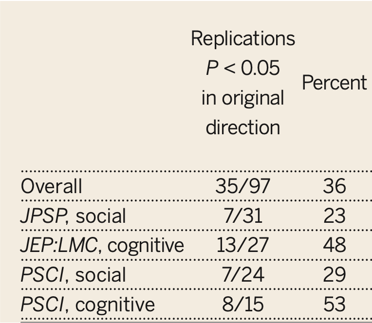
:::

::: {.column width="50%" .fragment}
::: {.img-large style="margin-top: -3em; display: flex; flex-direction: column; gap: 0.5em;"}
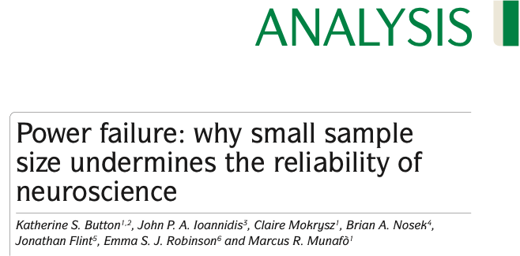


:::
:::
::::

::: {.citation-footer}
[@opensciencecollaboration2015]
:::

## Wheel of death

::: {.figure-container}
::: {.img-v-large}
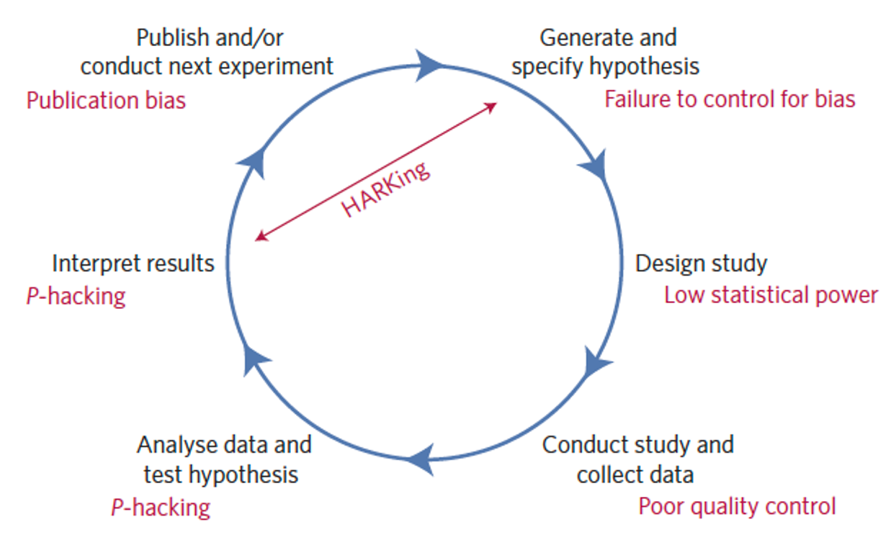
:::
:::

::: {.citation-footer}
[@munafo2017]
:::


## Towards a cumulative science? 

::: {.image-container .img-full}
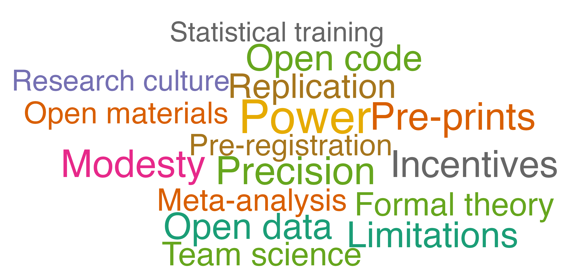
:::

::: {.citation-footer}
[@munafo2017; @ramsey2020; @ramsey2021]
:::

# New projects

- Social: Discrimination and group biases.
- [Cognitive: Event history analysis.]{.fragment .semi-fade-out fragment-index=1}
- [Computational: Evidence accumulation models.]{.fragment .semi-fade-out fragment-index=1} 

## Discrimination and group biases 

:::: {.columns}
::: {.column width="25%"}
::: {.image-container .img-small .img-center}


:::
:::

::: {.column width="25%"}
::: {.image-container .img-small .img-center}


:::
:::

::: {.column width="50%"}
::: {.image-container .img-v-large .img-center}

<br>
<br>
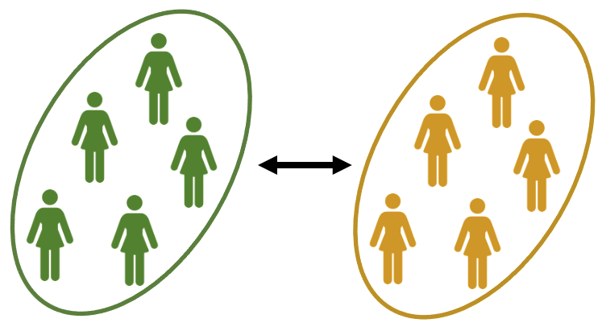
:::
:::
::::

## Minimal groups

:::: {.columns}

::: {.column width="50%"}
::: {.image-container .img-large .img-center}
<br>

:::
:::

::: {.column width="50%"}
::: {.image-container .img-v-large .img-center}

<br>
<br>

:::
:::

::::

::: {.citation-footer}
[@tajfel1970; @tajfel1974]
:::

## The minimal group paradigm

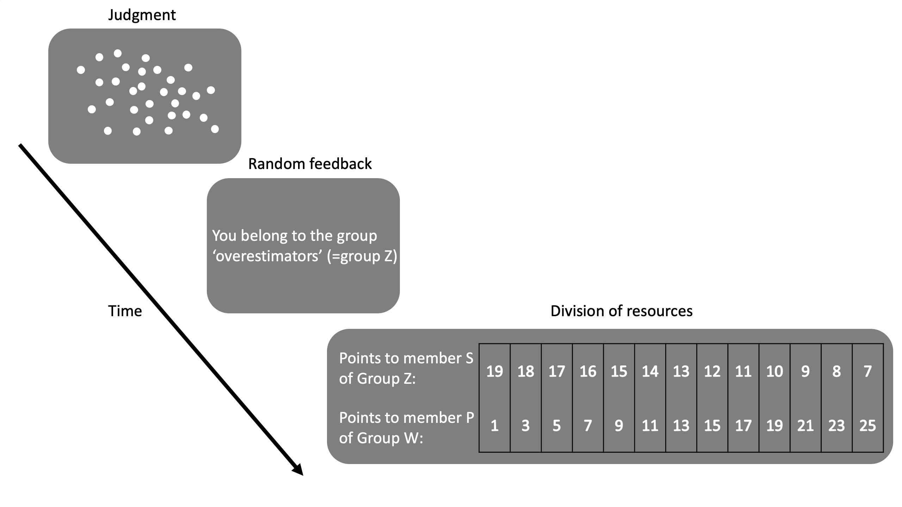

::: {.citation-footer}
[@tajfel1970; @tajfel1974]
:::

## Discriminatory strategies

<br>

```{r}
#| label: discrim-types
#| include: false

discrim <- tribble(
  ~Strategy, ~Label, ~Definition,
  "Parity", "P", "Equal division between ingroup and outgroup",
  "Maximum joint profit", "MJP", "Maximise points to the others in total",
  "Maximum ingroup profit", "MIP", "Maximise points to ingroup members in absolute terms",
  "Maximum differentiation", "MD", "Maximise the ingroup > outgroup difference",
  "Favouritism", "FAV", "Combination of MD and MIP"
)
discrim
```

```{r}
#| label: discrim-tab

discrim |> 
  gt() |> 
  tab_options(
    table.width = pct(100),
    table.font.size = px(26),
    column_labels.font.weight = "bold"
  ) |>
    opt_stylize()
```

## Tajfel's matrices 

```{r}
#| label: matrix-example
#| include: false

matrix <- tibble(
  Response = LETTERS[1:13],
  "...member 8 of the **overestimators** group" = seq(19,7),
  "...member 27 of the **underestimators** group" = seq(1,25, 2)
) |>
  pivot_longer(-Response, 
               names_to = "Person", 
               values_to = "value") |>
  pivot_wider(names_from = Response, 
              values_from = value)
matrix
```

```{r}
#| label: matrix-tab

matrix |> 
  gt() |>
  fmt_markdown(columns = everything()) |> 
  cols_width(
    Person ~ pct(30)  # Make first column narrower
  ) |> 
  tab_options(
    table.width = pct(100),
    table.font.size = px(26),
    column_labels.font.weight = "bold"
  ) |>
  opt_stylize()
```

::: {.incremental .text-small}
- You always assign values to other people (not yourself).
- Select one option (A-M), which corresponds to two values. In this example:
  - M = Maximum joint profit (MJP).
  - A = Ingroup favourtism (for overestimators) (FAV).
  
:::

::: {.citation-footer}
[@bourhis1994]
:::

## Tajfel's matrices 

```{r}
#| label: matrix-tab-repeat

matrix |> 
  gt() |>
  fmt_markdown(columns = everything()) |> 
  cols_width(
    Person ~ pct(30)  # Make first column narrower
  ) |> 
  tab_options(
    table.width = pct(100),
    table.font.size = px(26),
    column_labels.font.weight = "bold"
  ) |>
  opt_stylize()
```

::: {.incremental .text-small}

- This example matrix measures the "pull" of **FAV** on **MJP**.
  - e.g., selecting **A** would count as a "pull" of 12 positions from **M**.
- That value is contrasted to responses on a comparison/control matrix.
- This results in possible values from -12 to +12.

:::

::: {.citation-footer}
[@bourhis1994]
:::

## Pull scores

```{r}
#| label: pull-score-examples
#| include: false

pull_examples <- tribble(
  ~Discrimination, ~Pull, ~Intensity,
  "Outgroup", 4, "Low",
  "Outgroup", 8, "Medium", 
  "Outgroup", 12, "High",
  "None", 0, "None",
  "Ingroup", -4, "Low",
  "Ingroup", -8, "Medium",
  "Ingroup", -12, "High"
) |>
  mutate(
    Discrimination = factor(Discrimination,
                           levels = c("Outgroup", "None", "Ingroup")),
    Intensity = factor(Intensity,
                      levels = c("High", "Medium", "Low", "None"))
  )
pull_examples
```

```{r}
#| label: pull-examples-plot
#| fig-width: 5
#| fig-height: 6
#| fig-align: center

pull_examples |> 
  ggplot(aes(x = "", y = Pull, 
             color = Discrimination, alpha = Intensity)) +
  geom_point(size = 6) +
  scale_colour_brewer(palette = "Dark2", name = "Discrimination") +
  scale_alpha_manual(values = c("High" = 1.0, "Medium" = 0.7, "Low" = 0.4, "None" = 1.0),
                     guide = "none") +
  scale_y_continuous(limits = c(-13, 13), breaks = seq(-12, 12, 4)) +
  theme(axis.text.x = element_blank(),
        axis.title.x = element_blank(),
        axis.ticks.x = element_blank(),
        panel.grid.major.x = element_blank(),
        panel.grid.minor.x = element_blank(),
        legend.position = c(1.1, 0.53),
        legend.justification = c(0, 0.5),
        legend.key.height = unit(1.2, "cm"),
        plot.margin = margin(5, 60, 5, 5, "mm")) +
  coord_cartesian(clip = "off")
```

## Minimal group tasks

::: {style="position: relative; height: 65vh; width: 100%; overflow: hidden;"}

<!-- Image 1 - Top left, bottom layer -->
::: {style="position: absolute; top: 0%; left: 5%; z-index: 1;"}
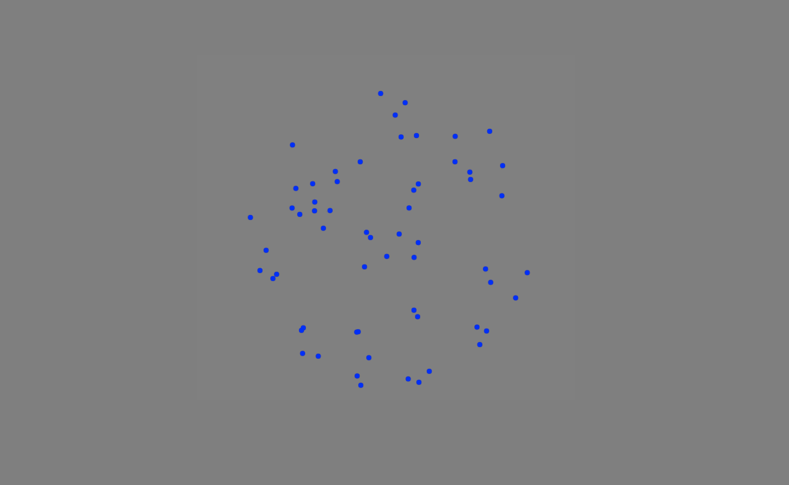{width="400px" style="border-radius: 10px; box-shadow: 0 8px 16px rgba(0,0,0,0.3);"}
:::

<!-- Image 2 - Center, middle layer -->
::: {style="position: absolute; top: 20%; left: 25%; z-index: 2;"}
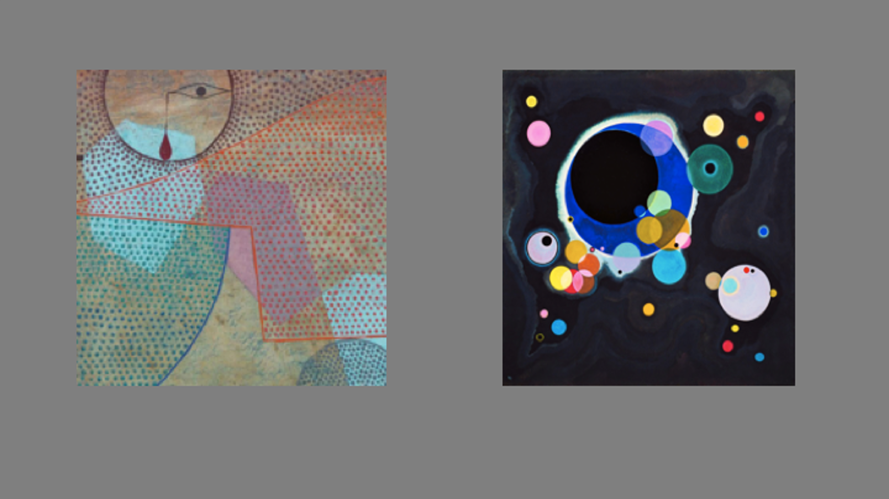{width="400px" style="border-radius: 10px; box-shadow: 0 8px 16px rgba(0,0,0,0.3);"}
:::

<!-- Image 3 - Bottom right, top layer -->
::: {style="position: absolute; top: 40%; left: 45%; z-index: 3;"}
{width="400px" style="border-radius: 10px; box-shadow: 0 8px 16px rgba(0,0,0,0.3);"}
:::

:::

## mpg-1 {background-image="images/paintings_pair1.png" background-size="cover" background-color="#767676" .no-title}

## mpg-2 {background-image="images/paintings_judgement.png" background-size="cover" background-color="#767676" .no-title}

## mpg-3 {background-image="images/paintings_group_assignment.png" background-size="cover" background-color="#767676" .no-title}

## mpg-4 {background-image="images/paintings_matrices.png" background-size="cover" background-color="#767676" .no-title}


## Minimal group findings {.no-title}

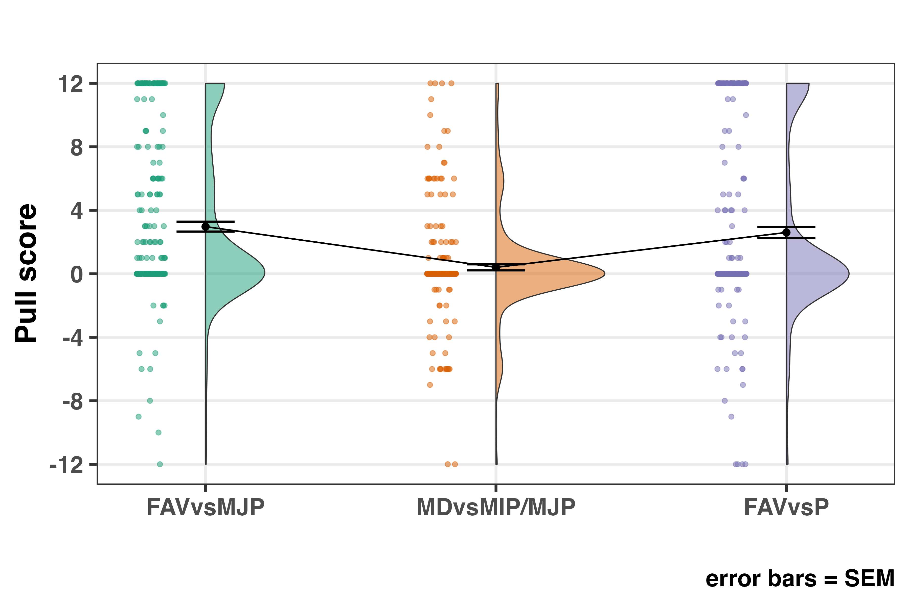

::: {.citation-footer}
[@schmidt2023]
:::

## Significance of the work

<br>

- Ingroup benefit and outgroup punishment was evident, even in arbitrary or "minimal" conditions.

::: {.fragment}
- Meaningful social categories, such as race, gender, age etc., are not required to discriminate against others.
:::

::: {.fragment}
- It formed a foundation of Social Identity Theory [@tajfel1979integrative].
:::

## Groups and social identity theory

> ... explicit references to group membership are logically necessary for operationalizing in these minimal situations the major independent variable—that is, social categorization per se. This requires not merely that the subjects perceive themselves as similar to or different from others as *individuals*, but that they are members of discrete and discontinuous categories—that is, "groups".

[@tajfel1979integrative [p. 39]] [*emphasis in the original*]

Citation count: 41,343

##  Groups and social identity theory

<br>

>It was as if that, just by inserting the word ‘group’ into the experimental instructions, the s’s definition of the situation was radically altered.

<br>

[@billig1973 [p. 48]]

Citation count: 2,538

## Confound

A similarity or difference ***between individuals*** covaries with group assignment.

<br>

:::: {.columns}

::: {.column width="50%"}
::: {.image-container .img-large .img-center .fragment}
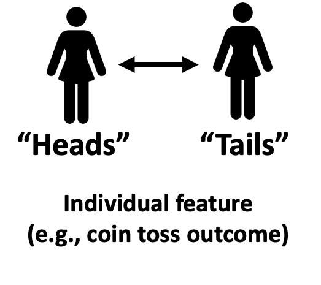
:::
:::

::: {.column width="50%"}
::: {.image-container .img-large .img-center .fragment}
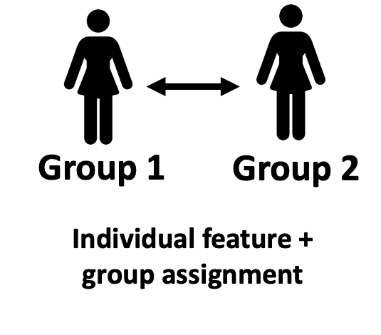
:::
:::

::::

## Conflict signals

- Why might a feature similarity or difference between individuals matter?

::: {.fragment}
- Cognitive neuroscience research shows that conflict in general is an aversive stimulus that guides behaviour.

```{r}
#| label: conflict-tab-data
#| include: false

conflict <- tibble(
  task = c("flanker", "Stroop"),
  congruent = c("HHHHH", "<span style='color: red;'>RED</span>"),
  incongruent = c("HHSHH", "<span style='color: green;'>RED</span>")
)

conflict
```

```{r}
#| label: conflict-tab

conflict |>
  gt() |>
  fmt_markdown(columns = everything()) |>
  tab_options(
    table.width = pct(60),
    table.font.size = px(26),
    column_labels.font.weight = "bold"
  ) |>
  opt_stylize()
```
:::

::: {.citation-footer}
[@botvinick2015; @dreisbach2015]
:::

## Conflict signals and groups

- Could sensitivity to conflict between individuals play a role in the minimal group paradigm?

:::: {.columns}
::: {.column width="50%"}
::: {.image-container .img-large .img-center}
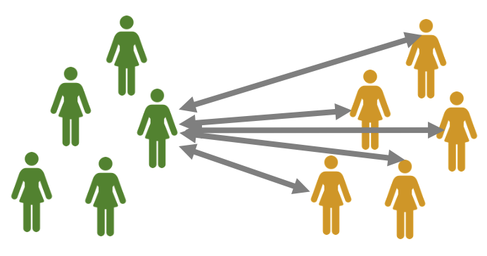
:::
:::

::: {.column width="50%"}
::: {.image-container .img-large}

:::
:::
::::

::: {.citation-footer}
[@deschrijver2020]
:::


## Comparing designs

::: {style="display: grid; grid-template-columns: auto repeat(3, 1fr); grid-template-rows: repeat(2, 1fr); gap: 0.8em; height: 40vh; padding: 1em; position: relative;"}

<!-- Row labels -->
::: {style="grid-area: 1 / 1; display: flex; align-items: center; justify-content: center; font-weight: bold; color: #666; font-size: 0.9em;"}
**Original design**
:::

::: {style="grid-area: 2 / 1; display: flex; align-items: center; justify-content: center; font-weight: bold; color: #666; font-size: 0.9em;"}
**Deschrijver & Ramsey (2025)**
:::

<!-- Top row -->
::: {style="grid-area: 1 / 2; background: #bbdefb; padding: 0.6em; text-align: center; border-radius: 6px; font-size: 0.85em;"}
**Arbitrary choices/coin flip**
:::
::: {style="grid-area: 1 / 3; background: #e1bee7; padding: 0.6em; text-align: center; border-radius: 6px; font-size: 0.85em;"}
**Group division / categorisation**  
:::
::: {style="grid-area: 1 / 4; background: #c8e6c9; padding: 0.6em; text-align: center; border-radius: 6px; font-size: 0.85em;"}
**Money allocation / matrices**  
:::

<!-- Bottom row -->
::: {style="grid-area: 2 / 2; background: #bbdefb; padding: 0.6em; text-align: center; border-radius: 6px; font-size: 0.85em;"}
**Arbitrary choices/coin flip**  
:::
::: {style="grid-area: 2 / 4; background: #c8e6c9; padding: 0.6em; text-align: center; border-radius: 6px; font-size: 0.85em;"}
**Money allocation / matrices**  
:::
:::

## deschrijver25-1 {background-image="images/dots.png" background-size="cover" background-color="#767676" .no-title}

## deschrijver25-2 {background-image="images/dots_judgement.png" background-size="cover" background-color="#767676" .no-title}

## deschrijver25-3 {background-image="images/dots_matrices.png" background-size="cover" background-color="#767676" .no-title}

## Descrijver & Ramsey (2025)

UK-based Prolific online sample. N=238 per experiment.

::: {style="position: relative; height: 65vh; width: 100%; overflow: hidden;"}

<!-- Image 1 - Top left, bottom layer -->
::: {style="position: absolute; top: 0%; left: 5%; z-index: 1;"}
{width="350px" style="border-radius: 10px; box-shadow: 0 8px 16px rgba(0,0,0,0.3);"}
:::

<!-- Image 2 - Center, middle layer -->
::: {style="position: absolute; top: 15%; left: 30%; z-index: 2;"}
{width="350px" style="border-radius: 10px; box-shadow: 0 8px 16px rgba(0,0,0,0.3);"}
:::

<!-- Image 3 - Bottom right, top layer -->
::: {style="position: absolute; top: 30%; left: 50%; z-index: 3;"}
{width="350px" style="border-radius: 10px; box-shadow: 0 8px 16px rgba(0,0,0,0.3);"}
:::

:::

## Resource allocation hypothesis

<br>

::: {.callout-note}
## Research question
Are group division and social identity required to treat people differently?
:::

<br>

::: {.callout-tip .fragment}
## Hypothesis
Resources will be allocated in favour of similar (versus dissimilar) individuals, in the absence of group division or social identity. 
:::

::: {.no-title}

## Raw data: minimal group dots 

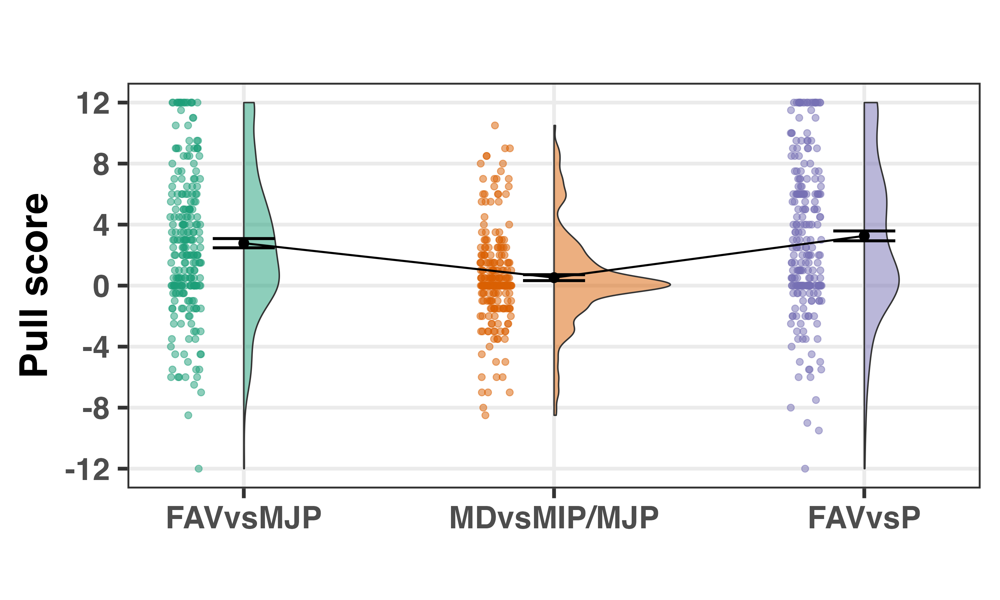

::: {.citation-footer}
[@deschrijver2025]
:::

:::

::: {.no-title}

## Regression parameters: minimal group {.hide-title}

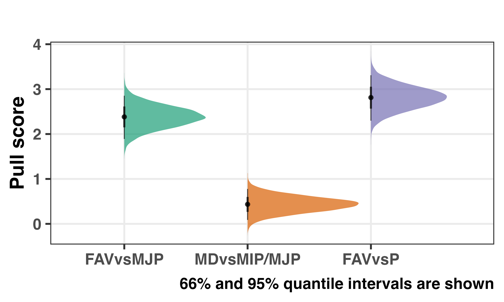

::: {.citation-footer}
[@deschrijver2025]
:::

:::

## Individual vs group manipulation

<br>

- Between groups design.

  - individual vs classic group manipulation

- Coins task (random outcome).

- N=238 per group (N=476 in total).

- UK-based online Prolific sample.


::: {.no-title}

## Regression parameters: individual vs group {.hide-title}

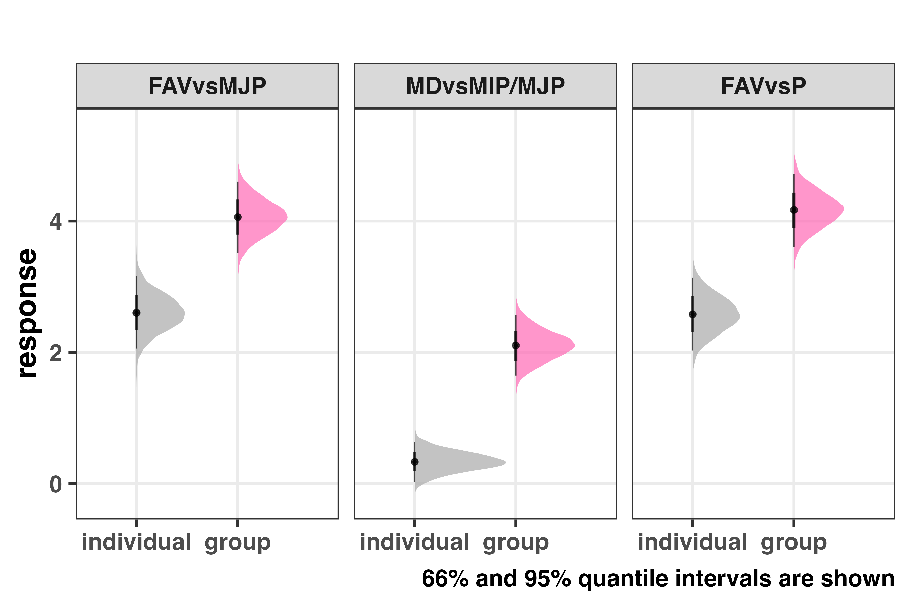

::: {.citation-footer}
[@deschrijver2025]
:::

:::

## What about a different task? 

- We wanted to move away from using Tajfel's matrices.
- We setup a congruency task based on work in cognitive psychology / neuroscience.

:::: {.columns}

::: {.column width="50%" .fragment}
**Step 1:** The other person's outcome is congruent or incongruent with your own.
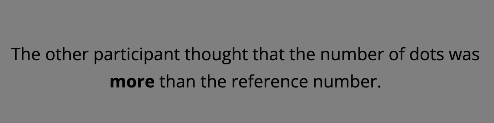
:::

::: {.column width="50%" .fragment}
**Step 2:** Allocate money via points.
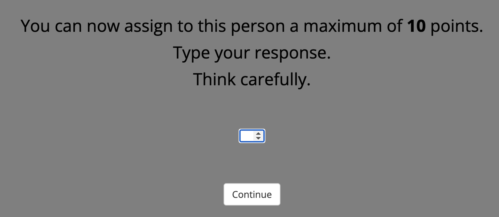
:::
::::

## Congruency trial structure

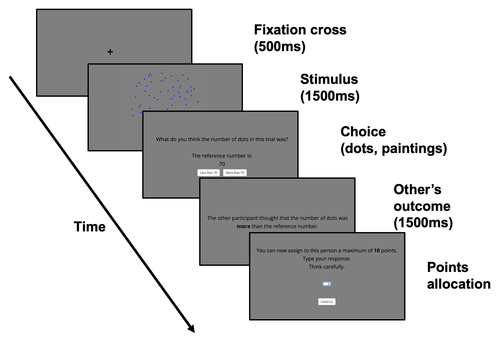

## Descrijver & Ramsey (2025)

UK-based Prolific online sample. N=75 per experiment.

::: {style="position: relative; height: 65vh; width: 100%; overflow: hidden;"}

<!-- Image 1 - Top left, bottom layer -->
::: {style="position: absolute; top: 0%; left: 5%; z-index: 1;"}
{width="350px" style="border-radius: 10px; box-shadow: 0 8px 16px rgba(0,0,0,0.3);"}
:::

<!-- Image 2 - Center, middle layer -->
::: {style="position: absolute; top: 15%; left: 30%; z-index: 2;"}
{width="350px" style="border-radius: 10px; box-shadow: 0 8px 16px rgba(0,0,0,0.3);"}
:::

<!-- Image 3 - Bottom right, top layer -->
::: {style="position: absolute; top: 30%; left: 50%; z-index: 3;"}
{width="350px" style="border-radius: 10px; box-shadow: 0 8px 16px rgba(0,0,0,0.3);"}
:::

:::

## Congruency hypothesis

<br>

::: {.callout-note}
## Research question
Are group division and social identity required to treat people differently?
:::

<br>

::: {.callout-tip .fragment}
## Hypothesis
More money will be allocated to others on congruent than incongruent trials, in the absence of group division or social identity.
:::

::: {.no-title}

## Raw data: congruency

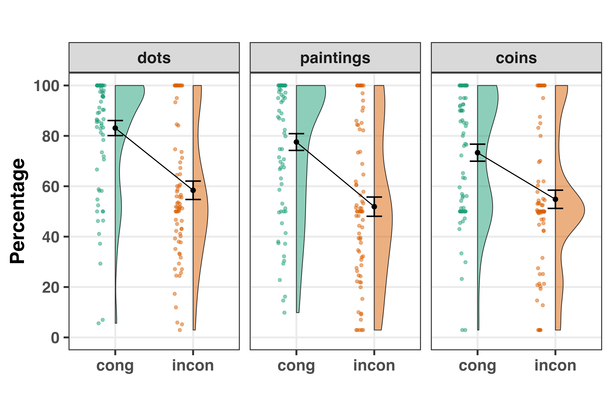

::: {.citation-footer}
[@deschrijver2025]
:::

:::

::: {.no-title}

## Regression parameters: congruency 

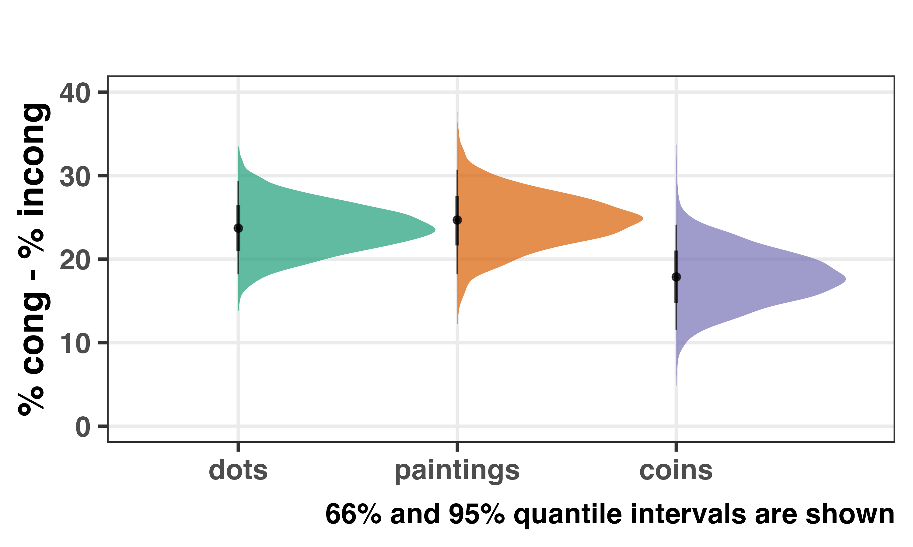

::: {.citation-footer}
[@deschrijver2025]
:::

:::

## Combined results

<br>

- Qualitatively similar minimal group paradigm effects are obtained ***without group assignment***.

::: {.fragment}
- Conflict tasks show that **43.1 % more money** (in relative terms) is given to individuals based on arbitrary sameness versus difference outcomes, ***in the absence of group assignment***.
:::

## Conclusion

- Is group division required to treat people differently? 

  - **No**
  
- Sameness versus difference ***between individuals*** is important to consider theoretically and empirically.

::: {.callout-important .fragment}
## Constraints on generality
We are ***not*** claiming that group division and social identity are unimportant or that differences between individuals can tell the whole story.
:::

## Implications

  - **Empirical:** When studying group bias and discrimination, sameness vs difference between individuals needs separating from the effect of group-based manipulations.
  
::: {.fragment}
  - **Theoretical:** Core tenets of Social Identity Theory need revision:
  
      - Other cognitive and neural mechanisms are likely to be at play in social contexts, such as the affective consequences of domain-general conflict detection and resolution.
      
:::

## Criticism

  >Ok, fine, but groups are "perceived" or "implicitly construed", even when groups a never mentioned.

::: {.fragment}
Three things are relevant here:
::: 

::: {.fragment .text-small}
1. Such an interpretation is in direct opposition to the explicit claims made in Social Identity Theory [-@tajfel1979integrative]. 
:::

::: {.fragment .text-small}
2. It is more difficult to conceptualise conflict tasks in terms of implicit groups. e.g., to consider trial-by-trial (in)congruence as outgroup vs ingroup processing. 
:::

::: {.fragment .text-small}
3. Social conflict tasks (like the ones used here) have been used for decades without the results being attributed to group-based or identity processes.
:::


# New projects

- [Social: Discrimination and group biases.]{.fragment .semi-fade-out fragment-index=1}
- Cognitive: Event history analysis.
- [Computational: Evidence accumulation models.]{.fragment .semi-fade-out fragment-index=1}

## Mean average performance

:::: {.columns}
::: {.column width="50%"}
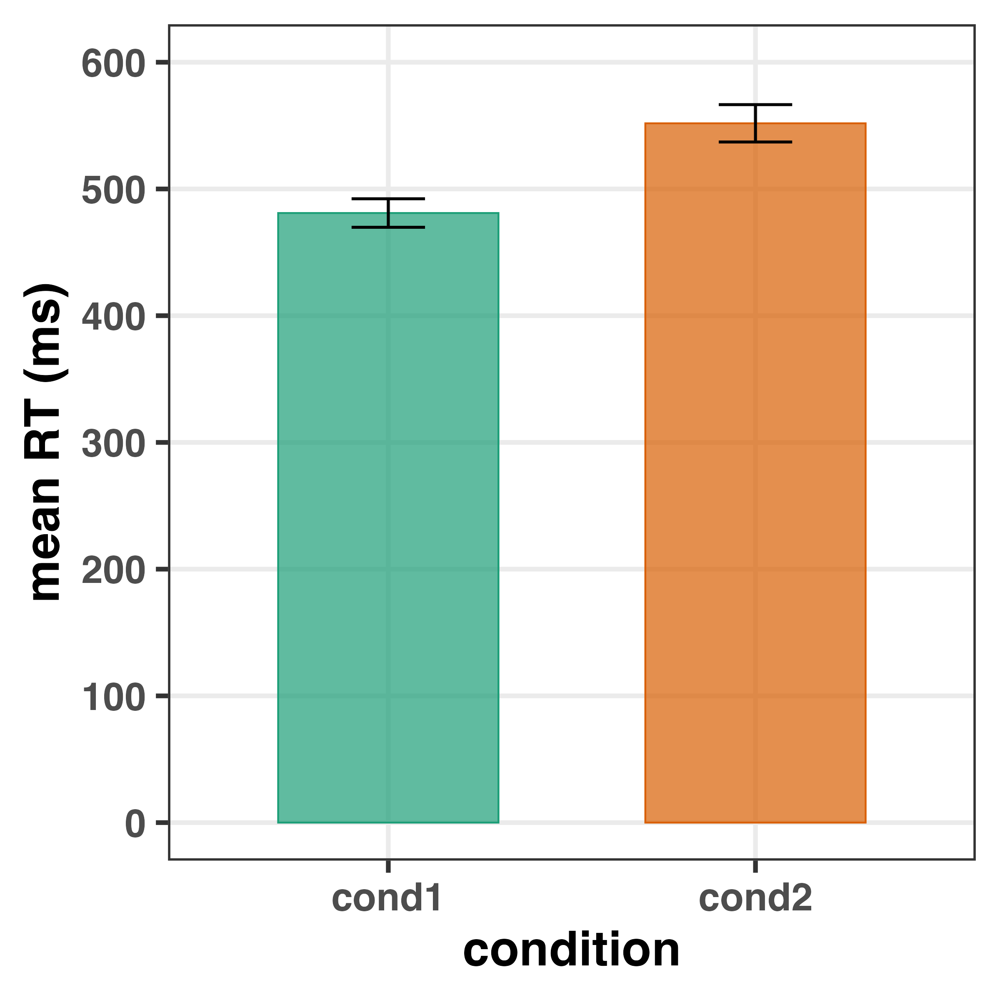
:::

::: {.column width="50%"}

:::
::::

## Event history analysis (EHA)

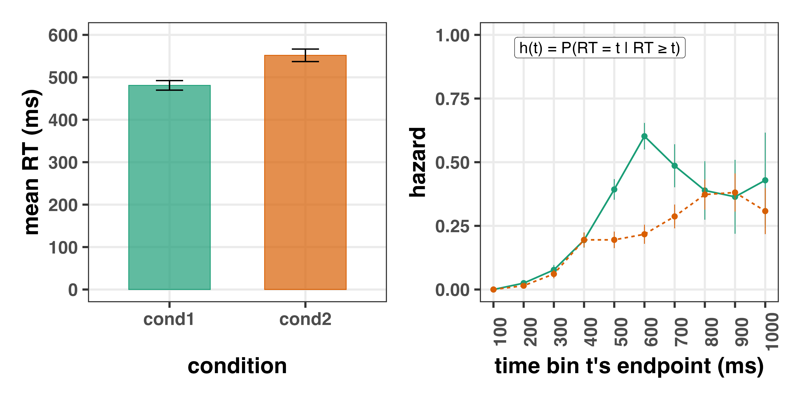

::: {.citation-footer}
[@panis2024; @singer2003]
:::

## Event history analysis (EHA)

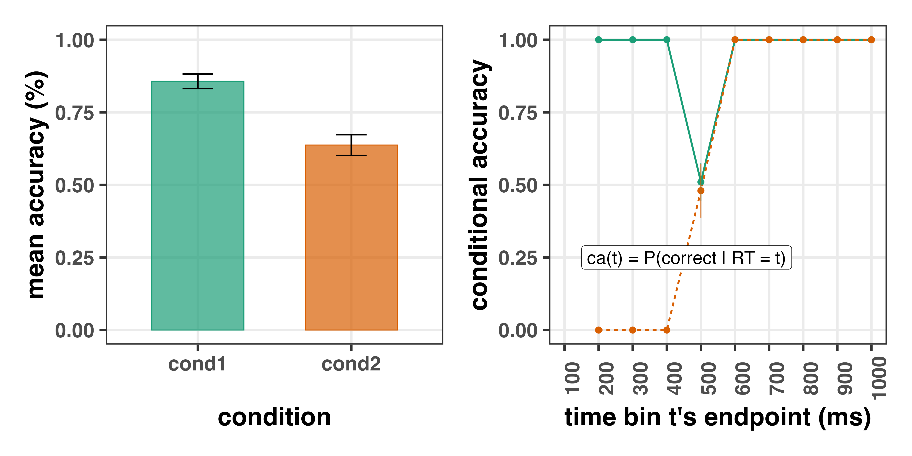

::: {.citation-footer}
[@panis2024; @singer2003]
:::

## EHA: How and why is it useful?

- You can ask questions about "temporal states" of cognition
  - e.g., When does a psychological state start and finish? How does it evolve with increased waiting time? Is it time-locked to other events?

::: {.fragment}
- Theory
- Psychophysiology
- Individual differences
:::

::: {.citation-footer}
[@panis2024]
:::

## EHA: A tutorial

- We have written a tutorial paper aimed at those interested in cognition and cognitive neuroscience. It covers:

  - Data wrangling.
  - Multi-level regression modelling (Bayesian & frequentist).
  - Inference.
  - Planning via data simulation. 

- All of the materials and tutorials are available on [GitHub](https://github.com/sven-panis/Tutorial_Event_History_Analysis).

::: {.citation-footer}
[@panis2024]
:::

# New projects

- [Social: Discrimination and group biases.]{.fragment .semi-fade-out fragment-index=1}
- [Cognitive: Event history analysis.]{.fragment .semi-fade-out fragment-index=1}
- Computational: Evidence accumulation models.

## A problem in theory?

<br>

:::: {.columns}
::: {.column width="50%"}
Narrative models
{style="width: 300px; height: auto;"}
:::

::: {.column width="50%"}
Formal models
{style="width: 300px; height: auto;"}
:::
::::

::: {.citation-footer}
[@hintzman1991; @yarkoni2022]
:::

## Evidence accumulation models 

<br>

:::: {.columns}
::: {.column width="35%"}
Integrate RT and accuracy as a function of model parameters (e.g., Linear Ballistic Accumulator model).
:::

::: {.column width="65%" .img-v-large .fragment}
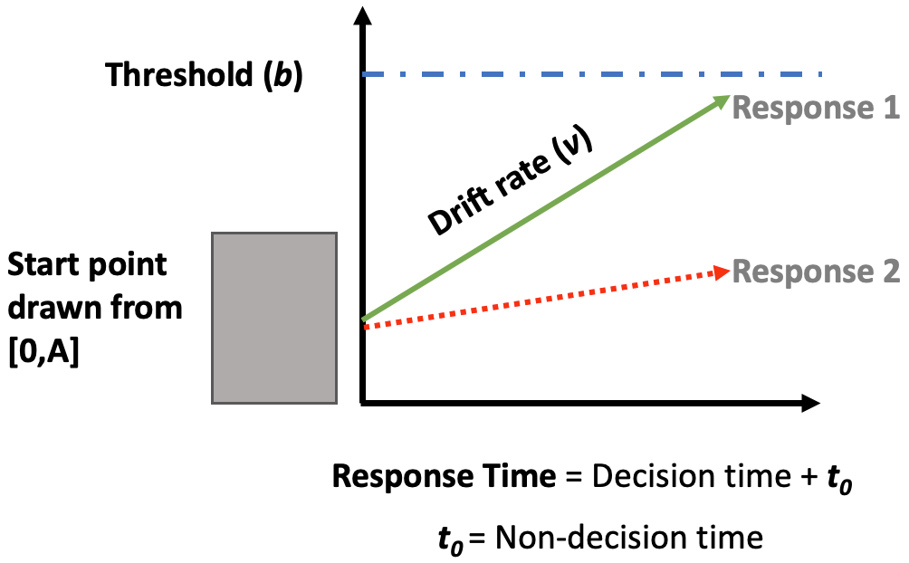
:::
::::

::: {.citation-footer}
[@parker2023; @heathcote2019; @ratcliff2016]
:::

## Mapping psychological constructs

- Model parameters map onto latent psychological constructs.

```{r}
#| label: lba-params
#| include: false

lba_params <- tribble(
  ~Parameter, ~Label, ~Construct,
  "Start point", "A", "response bias",
  "Drift rate", "v", "signal-to-noise ratio",
  "Threshold", "b", "response caution",
  "Non-decision time", "t<sub>0</sub>", "stimulus encoding and motor response"
)
lba_params
```

```{r}
#| label: lba-params-table

lba_params |> 
  gt() |> 
  fmt_markdown(columns = everything()) |> 
  tab_options(
    table.width = pct(80),
    table.font.size = px(26),
    column_labels.font.weight = "bold"
  ) |> 
  opt_stylize()
```

## Intuition

:::: {.columns}
::: {.column width="50%"}

:::

::: {.column width="50%"}

:::
::::

::: {.citation-footer}
[@myers2022]
:::

## Recent projects {.smaller}

::: {style="display: grid; grid-template-columns: 1fr 1fr 1fr 1fr; gap: 0.5em; text-align: center; padding: 0.5em;"}

::: {}
**Attention cueing via eye gaze**

{style="height: 180px; width: auto; margin: 1em 0;"}

[@parker2023]
:::

::: {}
**Observational learning**

{style="height: 180px; width: auto; margin: 1em 0;"}

[@parker2025]
:::

::: {}
**Face perception memory**

{style="height: 180px; width: auto; margin: 1em 0;"}

(Fournier, Downing & Ramsey, in prep.)

:::

::: {}
**A review paper for social cognition**

{style="height: 180px; width: auto; margin: 1em 0;"}

[@parker2023a]

:::

:::

# Summary

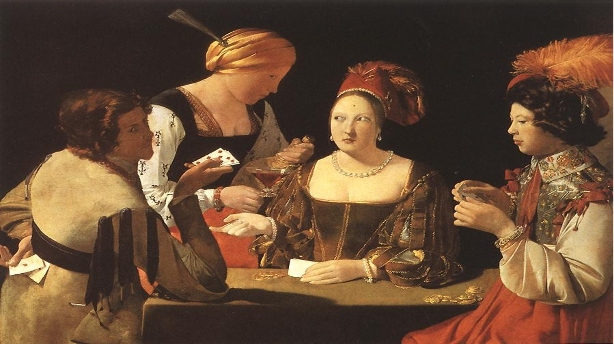{style="position: absolute; top: 0px; right: 20px; width: 500px; height: auto;"}

- Past research interests
- Motivating context
- New projects
  - Social: Discrimination and group biases.
  - Cognitive: Event history analysis. 
  - Computational: Evidence accumulation models.  

## Acknowledgements {.smaller}

:::: {.columns}
::: {.column width="33.3%"}

- Inez Greven
- Emily Butler
- Andrew Wildman
- Ionela Bara
- Chris Byrne
- Kohinoor Darda
- Dace Apšvalka
- Kohinoor Darda
- [**Raphaël Fournier**]{.underline}

:::

::: {.column width="33.3%"}

- Paul Downing
- Emily Cross
- Rudi Coetzer
- [**Eliane Deschrijver**]{.underline}
- Rob Ward
- Richard Binney
- Dave Kaplan
- [**Sam Parker**]{.underline}
- [**Sven Panis**]{.underline}

:::

::: {.column width="33.3%"}

{width=200px}
{width="200px"}

{width=200px}
{width=200px}
:::
::::


## And here's my stuff

<br>

-   Slides: [www.rich-ramsey.github.io/talks/uni-leeds-25/](rich-ramsey.github.io/talks/uni-leeds-25/){target='_blank'}

-   Code: [https://github.com/rich-ramsey/talks](rich-ramsey.github.io/talks/){target='_blank'}

-   Website: [www.rich-ramsey.com](www.rich-ramsey.com){target='_blank'}

-   Github: <https://github.com/rich-ramsey>{target='_blank'}

::: {style="text-align: center;"}
{width="200px"}
:::

## References

::: {#refs style="font-size: 0.8em;"}
:::

## Resources 

- Unless otherwise specified, icons were used under license from [The Noun Project](https://thenounproject.com/)

- Slides were created with [Quarto](https://quarto.org/) and [RevealJS](https://revealjs.com/)